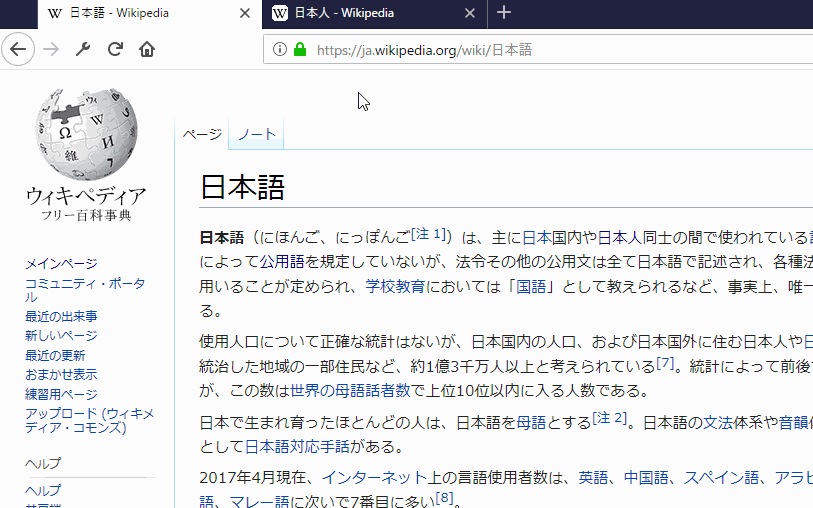
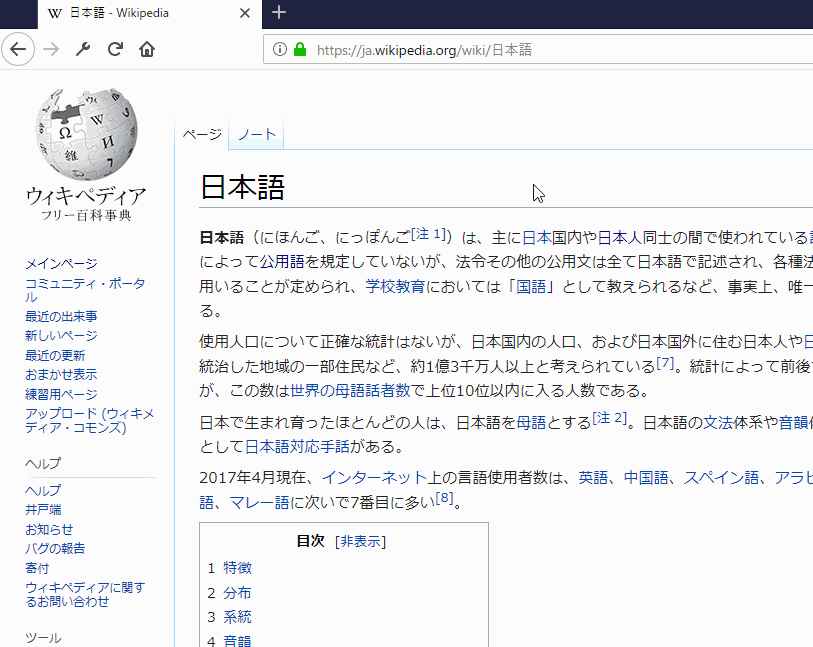

# copy-decoded-url

URLを日本語の状態(デコードした状態)でコピーします。

使い方1 ページを右クリックしてそのページのURLをコピー

使い方2 タブを右クリックしてそのタブのURLをコピー

使い方3 リンクを右クリックしてそのリンクのURLをコピー

以下のソースコードを参考に実装。  
https://github.com/mdn/webextensions-examples/tree/master/context-menu-copy-link-with-types
